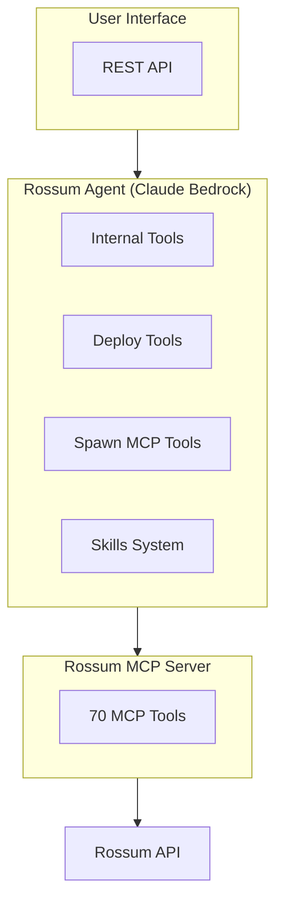

# Rossum Agent

<div align="center">

**AI agent for Rossum document processing. Debug hooks, deploy configs, and automate workflows conversationally.**

[](https://stancld.github.io/rossum-agents/)
[](https://pypi.org/project/rossum-agent/)
[](https://opensource.org/licenses/MIT)
[](https://pypi.org/project/rossum-agent/)
[](https://codecov.io/gh/stancld/rossum-agents)

[](https://github.com/rossumai/rossum-api)
[](https://modelcontextprotocol.io/)
[](https://www.anthropic.com/claude/opus)
[](https://github.com/astral-sh/ruff)
[](https://github.com/astral-sh/ty)
[](https://github.com/astral-sh/uv)

</div>

> [!NOTE]
> This is not an official Rossum project. It is a community-developed integration built on top of the Rossum API, not a product (yet).

## Features

| Capability | Description |
|------------|-------------|
| **Rossum MCP Integration** | Full access to 70 MCP tools for document processing |
| **Hook Debugging** | Test hooks via native Rossum API endpoints |
| **Deployment Tools** | Pull, push, diff, copy configs across environments |
| **Knowledge Base Search** | AI-powered Rossum documentation search |
| **Multi-Environment** | Spawn connections to different Rossum environments |
| **Skills System** | Load domain-specific workflows on demand |
| **Prompt Caching** | Automatic `cache_control` on system prompt, tools, and conversation history for up to 90% input token cost reduction |
| **Change Tracking** | Git-like config commit history with diffs, logs, and revert |

**Interfaces:** REST API, Python SDK

## Quick Start

```bash
# Set environment variables
export ROSSUM_API_TOKEN="your-api-token"
export ROSSUM_API_BASE_URL="https://api.elis.rossum.ai/v1"
export AWS_PROFILE="default"  # For Bedrock

# Run the agent API
uv pip install rossum-agent[api]
rossum-agent-api
```

## Installation

```bash
git clone https://github.com/stancld/rossum-agents.git
cd rossum-agents/rossum-agent
uv sync
```

**With extras:**
```bash
uv sync --extra all        # All extras (api, docs, tests)
uv sync --extra api        # REST API (FastAPI, Redis)
```

## Environment Variables

| Variable | Required | Description |
|----------|----------|-------------|
| `ROSSUM_API_TOKEN` | Yes | Rossum API authentication token |
| `ROSSUM_API_BASE_URL` | Yes | Base URL (e.g., `https://api.elis.rossum.ai/v1`) |
| `AWS_PROFILE` | Yes | AWS profile for Bedrock access |
| `AWS_DEFAULT_REGION` | No | AWS region (default: `us-east-1`) |
| `REDIS_HOST` | No | Redis host for chat persistence |
| `REDIS_PORT` | No | Redis port (default: `6379`) |
| `ROSSUM_MCP_MODE` | No | MCP mode: `read-only` (default) or `read-write` |
| `ROSSUM_AGENT_PERSONA` | No | Agent persona: `default` (default) or `cautious` — read by the TUI client, not the server |

## Usage

### REST API

```bash
# Development (uvicorn)
rossum-agent-api --host 0.0.0.0 --port 8000 --reload

# Production (gunicorn)
rossum-agent-api --server gunicorn --host 0.0.0.0 --port 8000 --workers 4
```

| Option | Server | Description |
|--------|--------|-------------|
| `--server` | both | Backend: `uvicorn` (default) or `gunicorn` |
| `--host` | both | Host to bind to (default: 127.0.0.1) |
| `--port` | both | Port to listen on (default: 8000) |
| `--workers` | both | Number of worker processes (default: 1) |
| `--reload` | uvicorn | Enable auto-reload for development |

### Python SDK

```python
import asyncio
from rossum_agent.agent import create_agent
from rossum_agent.rossum_mcp_integration import create_mcp_connection

async def main():
    mcp_connection = await create_mcp_connection()
    agent = await create_agent(mcp_connection=mcp_connection)

    async for step in agent.run("List all queues"):
        if step.final_answer:
            print(step.final_answer)

asyncio.run(main())
```

## Available Tools

The agent provides internal tools and access to 70 MCP tools via dynamic loading.

<details>
<summary><strong>Internal Tools</strong></summary>

**File & Knowledge:**
- `write_file` - Save reports, documentation, analysis results
- `search_knowledge_base` - Search Rossum docs with AI analysis (sub-agent)
- `kb_grep` - Regex search across Knowledge Base article titles and content
- `kb_get_article` - Retrieve full Knowledge Base article by slug

**API Reference:**
- `elis_openapi_jq` - Query Rossum API OpenAPI spec with jq
- `elis_openapi_grep` - Free-text search in API spec
- `search_elis_docs` - AI-powered search of API documentation

**Formula:**
- `suggest_formula_field` - Suggest formula field expressions via Rossum Local Copilot

**Lookup Fields:**
- `suggest_lookup_field` - Suggest lookup field matching configuration for MDH datasets
- `evaluate_lookup_field` - Evaluate lookup field results on a real annotation
- `get_lookup_dataset_raw_values` - Fetch raw MDH dataset rows for unmatched/ambiguous case verification

**Schema:**
- `create_schema_with_subagent` - Create new schemas via Opus sub-agent
- `patch_schema_with_subagent` - Safe schema modifications via Opus

**Deployment:**
- `deploy_pull` - Pull configs from organization
- `deploy_diff` - Compare local vs remote
- `deploy_push` - Push local changes
- `deploy_copy_org` - Copy entire organization
- `deploy_copy_workspace` - Copy single workspace
- `deploy_compare_workspaces` - Compare two workspaces
- `deploy_to_org` - Deploy to target organization

**Multi-Environment:**
- `spawn_mcp_connection` - Connect to different Rossum environment
- `call_on_connection` - Call tools on spawned connection
- `close_connection` - Close spawned connection

**Skills:**
- `load_skill` - Load domain-specific workflows (`rossum-deployment`, `schema-patching`, `schema-pruning`, `organization-setup`, `schema-creation`, `ui-settings`, `hooks`, `txscript`, `rules-and-actions`, `formula-fields`, `reasoning-fields`)

**Task Tracking:**
- `create_task` - Create a task to track progress on multi-step operations
- `update_task` - Update a task's status (`pending`, `in_progress`, `completed`) or subject
- `list_tasks` - List all tracked tasks with current status

</details>

<details>
<summary><strong>Dynamic MCP Tool Loading</strong></summary>

Tools are loaded on-demand to reduce context usage. Use `load_tool_category` to load tools by category:

| Category | Description |
|----------|-------------|
| `annotations` | Upload, retrieve, update, confirm documents |
| `queues` | Create, configure, list queues |
| `schemas` | Define, modify field structures |
| `engines` | Extraction and splitting engines |
| `hooks` | Extensions and webhooks |
| `email_templates` | Automated email responses |
| `document_relations` | Export/einvoice links |
| `relations` | Annotation relations |
| `rules` | Schema validation rules |
| `users` | User and role management |
| `workspaces` | Workspace management |

Categories are auto-loaded based on keywords in the user's message.

</details>

## Architecture



<details>
<summary><strong>REST API Endpoints</strong></summary>

| Endpoint | Description |
|----------|-------------|
| `GET /api/v1/health` | Health check |
| `GET /api/v1/chats` | List all chats |
| `POST /api/v1/chats` | Create new chat |
| `GET /api/v1/chats/{id}` | Get chat details |
| `DELETE /api/v1/chats/{id}` | Delete chat |
| `POST /api/v1/chats/{id}/messages` | Send message (SSE) |
| `GET /api/v1/chats/{id}/files` | List files |
| `GET /api/v1/chats/{id}/files/{name}` | Download file |

API docs: `/api/docs` (Swagger) or `/api/redoc`

**SSE Events:** The message endpoint streams these SSE event types:

| SSE `event:` | Description |
|--------------|-------------|
| `step` | Agent steps (thinking, tool calls, final answer) |
| `sub_agent_progress` | Sub-agent iteration updates |
| `sub_agent_text` | Sub-agent text streaming |
| `task_snapshot` | Task tracker state after each task mutation |
| `file_created` | Output file notification |
| `done` | Final event with token usage |
| `error` | Agent execution error |

**MCP Mode:** Chat sessions support mode switching via the `mcp_mode` parameter:
- Set at chat creation: `POST /api/v1/chats` with `{"mcp_mode": "read-write"}`
- Override per message: `POST /api/v1/chats/{id}/messages` with `{"content": "...", "mcp_mode": "read-write"}`

**Persona:** Chat sessions support persona switching via the `persona` parameter:
- Set at chat creation: `POST /api/v1/chats` with `{"persona": "cautious"}`
- Override per message: `POST /api/v1/chats/{id}/messages` with `{"content": "...", "persona": "cautious"}`

</details>

## License

MIT License - see [LICENSE](../LICENSE) for details.

## Resources

- [Full Documentation](https://stancld.github.io/rossum-agents/)
- [MCP Server README](../rossum-mcp/README.md)
- [Rossum API Documentation](https://rossum.app/api/docs/)
- [Main Repository](https://github.com/stancld/rossum-agents)
